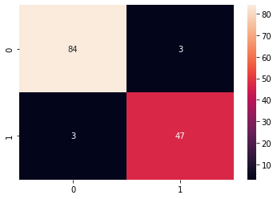
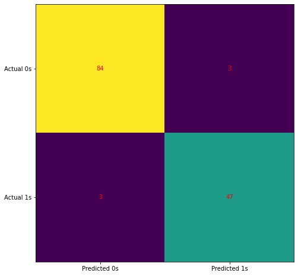

# Using Python and Logistic Regression (Binary Class Classification), predict whether cancer is benign or malignant.

Dataset Used: Breast Cancer Wisconsin (Diagnostic) Dataset

Accuracy of a confusion matrix :0.956

k-Fold Cross Validation Results:

Accuracy: 96.89 %
Standard Deviation: 1.85 %
## Install Requirements

```bash
$ pip install -r requirement.txt
```


